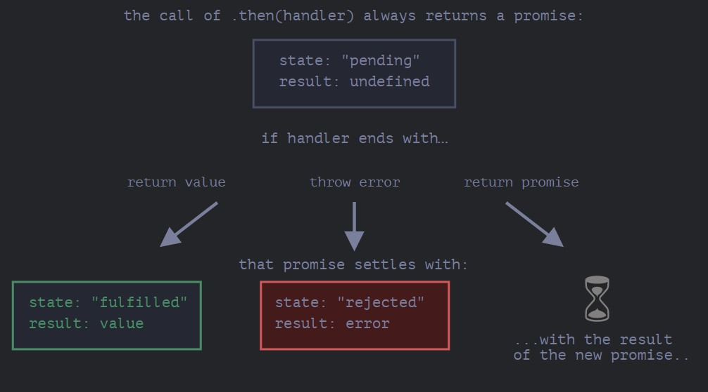

# Async JS

>How does js works?
>difference between async and synchronous js
>single-threaded?none-blocking?

## promise

>promise is an object that may produce a single value some time in the future
>resolved value/a reason why rejected

- catch:发现写在她之前的所有错误,then,获取promise的value值
- promise.all
- promise.allsettled
- then
- 

## async await

- generator的语法糖
- try catch

## es8

1. object spread operator
   - 浅拷贝
   - 改变对象
2. finally():无论是否成功最后都会运行，无法得到事件处理结果，

## Job queue(微任务queue)

>event loop先检查job queue，再检查callback queue
>用于promise等

## concurrency

# modules

## commonjs

- require